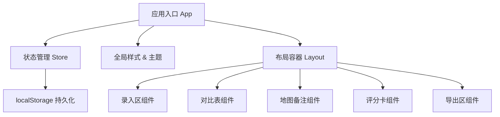

## 1. 架构设计

本项目为纯前端单页应用，所有数据存储在浏览器 localStorage 中，无需后端服务。采用组件化架构，各功能模块独立封装，通过状态管理进行数据通信。



## 2. 技术描述

- **前端框架**：React@18 + TypeScript
- **构建工具**：Vite@5
- **样式方案**：TailwindCSS@3 + CSS 变量
- **状态管理**：React useState + useReducer + Context
- **数据持久化**：localStorage
- **字体方案**：Google Fonts (Noto Serif SC + Noto Sans SC)
- **图标方案**：Lucide React

## 3. 数据模型

### 3.1 房源数据结构

```typescript
interface House {
  id: string;
  name: string;
  address: string;
  rent: number;
  deposit: number;
  area: number;
  roomType: string;
  commuteTime: number;
  roommates: string;
  moveInDate: string;
  lighting: string;
  noise: string;
  facilities: string;
  riskNotes: string;
  mapNotes: MapNote[];
  ratings: Ratings;
  createdAt: string;
  updatedAt: string;
}

interface MapNote {
  id: string;
  category: 'business' | 'subway' | 'school' | 'hospital' | 'food' | 'other';
  name: string;
  description: string;
}

interface Ratings {
  safety: number;
  valueForMoney: number;
  convenience: number;
  comfort: number;
}
```

### 3.2 排序维度

| 维度 | 说明 | 排序方式 |
|------|------|----------|
| 总成本 | 租金 + 押金分摊 | 升序/降序 |
| 通勤 | 通勤时间（分钟） | 升序/降序 |
| 采光 | 采光评价等级 | 自定义排序 |
| 噪音 | 噪音评价等级 | 自定义排序 |
| 设施 | 设施完善度 | 自定义排序 |
| 风险备注 | 风险等级评估 | 自定义排序 |

## 4. 组件划分

| 组件名 | 路径 | 职责 |
|--------|------|------|
| App | /src/App.tsx | 应用入口，状态管理，数据持久化 |
| Layout | /src/components/Layout.tsx | 页面整体布局容器 |
| HouseForm | /src/components/HouseForm.tsx | 房源信息录入表单 |
| HouseList | /src/components/HouseList.tsx | 房源列表管理 |
| CompareTable | /src/components/CompareTable.tsx | 多维度对比表格 |
| MapNotes | /src/components/MapNotes.tsx | 地图位置备注 |
| RatingCard | /src/components/RatingCard.tsx | 评分卡片组件 |
| ExportPanel | /src/components/ExportPanel.tsx | 导出功能面板 |
| StarRating | /src/components/StarRating.tsx | 星级评分组件 |
| TagInput | /src/components/TagInput.tsx | 标签输入组件 |

## 5. 存储方案

- **存储方式**：localStorage 本地存储
- **存储键名**：`rental-compare-data`
- **数据格式**：JSON 字符串
- **触发时机**：数据变更时自动保存
- **初始化**：页面加载时从 localStorage 读取并恢复状态

## 6. 导出功能

- **看房清单**：按房源整理的看房计划，包含地址、联系方式、预约时间
- **问题清单**：看房时需要询问的问题列表，可自定义问题
- **候选列表**：筛选后的最终候选房源，按综合评分排序
- **导出方式**：文本格式化输出 + 一键复制到剪贴板
